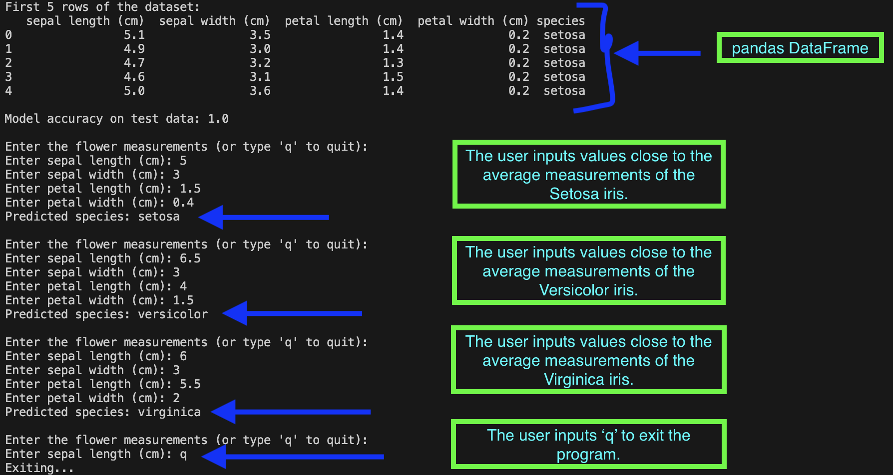

# 🧠 Machine Learning Classification with the Iris Dataset (scikit-learn)

## 📘 Overview
This project demonstrates a **machine learning classification task** using the **Iris dataset**.  
A **Random Forest Classifier** from `scikit-learn` predicts the species of an iris flower using four key measurements:  
- Sepal Length  
- Sepal Width  
- Petal Length  
- Petal Width  

The program also includes an **interactive prediction mode**, where users can input custom values to predict the flower species in real time.

---

## 🌸 Sepal and Petal Visualization


This diagram illustrates the difference between **sepals** and **petals** in an iris flower.  
These four dimensions form the features used to train the model.

---

## ⚙️ Step 1: Import Libraries


### Explanation of Libraries
| Library | Purpose |
|----------|----------|
| `scikit-learn` | Provides the **RandomForestClassifier**, dataset loading, and model evaluation tools. |
| `pandas` | Used to format and display data in structured **DataFrames** for easy visualization. |
| `numpy` | Handles numerical operations and array-based data structures. |
| `accuracy_score` | Measures the accuracy of model predictions. |
| `train_test_split` | Divides the dataset into **training** and **testing** subsets. |

---

## 📊 Step 2: Data Splitting


The dataset is divided using an **80/20 split**:
- **Training set (80%)** — Used to teach the model patterns in the data.  
- **Test set (20%)** — Used to evaluate how well the model generalizes to unseen data.  

This prevents **overfitting** and provides a fair accuracy measurement.

---

## 🌼 Step 3: Input and Output Example



This figure shows example user inputs and model predictions.  
Three test inputs were entered — each corresponding to one of the three Iris species:

1. **Setosa**  
2. **Versicolor**  
3. **Virginica**

The classifier accurately identified all species, achieving **100% accuracy** on the test data.

---

## 🧠 Step 4: Model and Dataset Summary

### Iris Dataset Measurement Ranges

| Species        | Sepal Length (cm) | Sepal Width (cm) | Petal Length (cm) | Petal Width (cm) |
|----------------|------------------:|-----------------:|------------------:|-----------------:|
| **Setosa**     | 4.3 – 5.8 | 2.3 – 4.4 | 1.0 – 1.9 | 0.1 – 0.6 |
| **Versicolor** | 4.9 – 7.0 | 2.0 – 3.4 | 3.0 – 5.1 | 1.0 – 1.8 |
| **Virginica**  | 4.9 – 7.9 | 2.2 – 3.8 | 4.5 – 6.9 | 1.4 – 2.5 |

These measurements define the physical distinctions between the three Iris species and form the foundation for classification.

---

## 🧩 Technologies Used
- **Python**
- **scikit-learn**
- **pandas**
- **NumPy**

---

## 🚀 Running the Program

### 1. Install Dependencies
```bash
pip install scikit-learn pandas numpy
